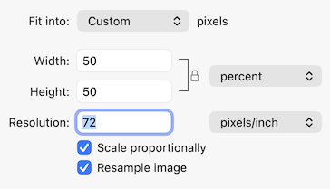
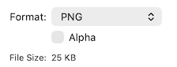
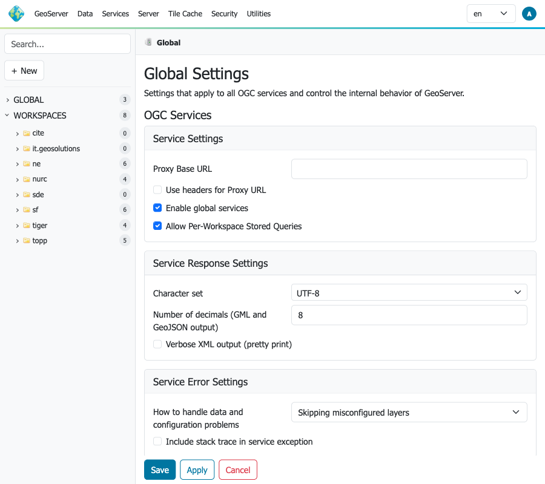
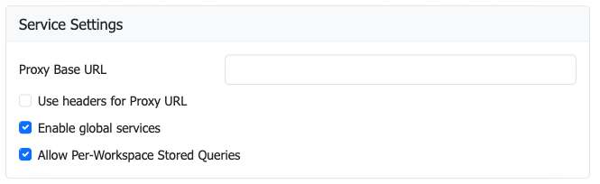
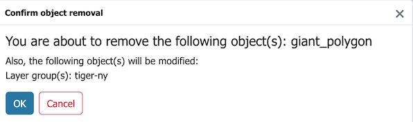

# Markdown Syntax

These markdown conventions are carefully constructed for consistent representation of user interface elements, files, data and field input.

## Basic markup

The simplest Markdown elements are:

| **Format** | **Syntax**        | **Output**  |
|------------|-------------------|-------------|
| Italics    | `*italics*`       | *italics*   |
| Bold       | `**bold**`        | **bold**    |
| Monospace  | `` `monospace` `` | `monospace` |


These elements are used for consistent representation of user interface elements, files, data and field input.

| Markdown                       | Subject                     | Example |
|--------------------------------|-----------------------------|---------|
| `**strong**`                   | gui label, menu selection   | **Apply**
| `` `monospace` ``              | text input, item selection  | `admin` |
| `*emphasis*`                   | figure (caption)            | *Diagram 1* |
| `***strong-emphasis***`        | application, command        | ***PostGIS*** |
| `` **`monospace-strong`** ``   | file, path reference        | **`example.gpkg`** |

!!! note

    The above conventions are important for consistency, and allow for documentation translation.
    As an example we do not wish to translate a layer name, so these are represented as monospace text input.


### User interface components

Use `**button**` to name user interface components for interaction (press for buttons, click for link).

=== "Markdown"

    ```markdown
    Navigate to **Data --> Layers** page,
    and press **Add a new layer** to create a new layer.
    ```

=== "Preview"

    Navigate to **Data --> Layers** page,
    and press **Add a new layer** to create a new layer.

### User input

Use `` `item` `` monospace for user supplied input, or item in a list or tree:

=== "Markdown"

    ```markdown
    Select `Basemap` layer.
    ```

=== "Preview"

    Select `Basemap` layer.


Use `` `text` `` monspace for user supplied text input:

=== "Markdown"

    ```markdown
    Use the *Search* field enter `sf`.
    ```

=== "Preview"

    Use the *Search* field enter `sf`.


Use `++key++` for keyboard keys.

=== "Markdown"

    ```markdown
    Press ++control+f++ to find on page.
    ```

=== "Preview"

    Press ++control+f++ to find on page.
    
Use definition list to document data entry. The field names use strong as they name a user interface element. Field values to input uses monspace as user input to type in.

=== "Markdown"

    ```markdown
    1.  To login as the GeoServer administrator using the default password:
    
        **User**
        :   `admin`
    
        **Password**
        :   `geoserver`
    
        **Remeber me**
        :   Unchecked
    
        Press **Login**.
    ```

=== "Preview"

    1.  To login as the GeoServer administrator using the default password:
    
        **User**
        :   `admin`
    
        **Password**
        :   `geoserver`
    
        **Remeber me**
        :   Unchecked
    
        Press **Login**.

### Applications, commands and tools

Use `***command***` (combination of **bold** and *italics*) for proper names of applications, commands, tools, and products.

=== "Markdown"

    ```markdown
    Launch ***pgAdmin*** and connect to the databsae `tutorial`.
    ```

=== "Preview"

    Launch ***pgAdmin*** and connect to the databsae `tutorial`.

### Files

Use `` **`file.txt`** `` (combine **bold** **monospace**) for files and path references:

=== "Markdown"

    ```markdown
    See configuration file
    **`security/rest.properties`**
    for access control.
    ```

=== "Preview"
    
     See configuration file **`security/rest.properties`** for access control.

### Icons, Images and Figures

Material for markdown has extensive icon support, for most user interface elements we can directly make use of the appropriate icon in Markdown:

- Use Material for mkdocs [Icons, Emojis](https://squidfunk.github.io/mkdocs-material/reference/icons-emojis/) page to serach included icons.
- You can also refrence emojii by name
- Add custom icons to **`overrides/.icons/silk`** .

=== "Markdown"

    ```markdown
    1.  Press the **:material-plus: Add Layer** button at the top of the page.
    ```

=== "Preview "

    1.  Press the **:material-plus: Add Layer** button at the top of the page.

Figures are handled by convention, adding emphasized text after each image, and trust CSS rules to provide a consistent presentation:

* The image has two trailing `  ` space characters, to affect a newline to position the caption under the figure.
* The caption uses `*emphasis*` appearance.

=== "Markdown"

    ```markdown
      
    *Keywords with **Add Layer**, and individual **Remove Layer** buttons.*
    ```

=== "Preview"
   
      
    *Keywords with **Add Layer**, and individual **Remove Layer** buttons.*

Raw images are not used very often:

=== "Markdown"

    ```markdown
    
    ```

=== "Preview"

    

### Screenshots

Take consistent screenshots by following these guidelines:

* Create a responsive design profile of 900 x 800 for consistent size of on screen components.
  This size allows the user interface to display two-column layout of forms, and
  avoid responsive design layout changes.
  
    This can be accomplished using responsive design mode in your browser development tools.
    
    The browser may also have a screenshot button to save an image at the requested DPI.

* Use light appearance in the application, adjust monitor to sRGB.

Be considerate of file size:

* If taking a screenshot with HiDPI display, process by 50% to 72 DPI.
  
      
    *Screen Snap scale to 72 DPI*
    
    !!! tip
        You may find it faster to adjust monitor resolution in order
        avoid this step when making a lot of screenshots.
       
* No need to include an alpha band when saving PNG

      
    *Do not include alpha band when saving*

Full screen 900 x 800 is used sparingly, and are presented as figures (with a caption):

=== "Markdown"
    
    ```markdown
      
    *Full screen*
    ```

=== "Preview"

      
    *Full screen*

Crop for form and data entry steps:

=== "Markdown"
    
    ```markdown
      
    *Form screen snap*
    ```

=== "Preview"

      
    *Form screen snap*

Scale for smaller elements like dialogs and menus:

=== "Markdown"
    
    ```markdown
    {: width=50%}  
    *Dialog screen snap*
    ```

=== "Preview"

    {: width=50%}  
    *Dialog screen snap*


### Lists

Bulleted lists:

=== "Markdown"

    ```markdown
    - An item
    - Another item
    - Yet another item
    ```

=== "Preview"

    - An item
    - Another item
    - Yet another item

Numbered lists:

=== "Markdown"

    1. First item
    2. Second item
    3. Third item

=== "Preview"

    ```markdown
    1. First item
    2. Second item
    3. Third item
    ```

Nested bullets and outdenting

=== "Markdown"
    
    ```markdown
    - Top level
        - Nested level
    ```

=== "Preview"

    - Top level
        - Nested level

To return to top level, use 0 indentation again. For example:

=== "Markdown"

    ```markdown
    - Top level
        - Nested
    - Back to top level
    ```

=== "Preview"

    - Top level
        - Nested
    - Back to top level

### Tables

Documentation uses pipe-tables only "List-packed" tables
as they are supported by both ***mkdocs*** and ***pandoc***.

Tables are constructed with Leading / tailing `|`, and headers seperated by `---`.

=== "Markdown"
    
    ```markdown
    | Shapes | Description |
    |--------|-------------|
    | Square | Four sides of equal length, 90 degree angles |
    | Rectangle | Four sides, 90 degree angles |
    ```
    
=== "Preview"

    | Shapes | Description |
    |--------|-------------|
    | Square | Four sides of equal length, 90 degree angles |
    | Rectangle | Four sides, 90 degree angles |

Column alignment using `:`

=== "Markdown"
    
    ```Markdown
    | First Header | Second Header | Third Header |
    |:-------------|:-------------:|-------------:|
    | Left         |    Center     |        Right |
    | Left         |    Center     |        Right |
    ```
=== "Preview"

    | First Header | Second Header | Third Header |
    |:-------------|:-------------:|-------------:|
    | Left         |    Center     |        Right |
    | Left         |    Center     |        Right |

### Notes and warnings (admonitions)

GeoServer documentation uses the `admonition` extension in Markdown for notes and warnings.

* default: `note`
* admonition: `abstract`, `quote`, `question`, `info`, `tip`, `example`
* caution: `warning`, `danger`
* result: `success`, `failure`. `bug`
* [Reference: Admonitions](https://squidfunk.github.io/mkdocs-material/reference/admonitions/)

Important user guidance:

- `!!! note`, `!!! warning`, etc. is valid at top level, and in list nesting when indented to the same depth as surrounding list content.
- For top-level admonitions, use 0-3 spaces before `!!!` and indent block content by 4 spaces.
- For nested admonitions in lists, align `!!!` with the list item block content (e.g. 4 / 8 / 12 spaces depending on nesting).

   This means `!!!` can be at 12 spaces and still render when it is nested in a list item at that depth.

=== "Markdown"

    ```Markdown
    !!! note
        Do not wait for a release to fall out of support before upgrading.
    ```

=== "Preview"

    !!! note
        Do not wait for a release to fall out of support before upgrading.

Changing the title:

=== "Markdown"

    ```Markdown
    !!! tip "Upgrade Often"
        Do not wait for a release to fall out of support before upgrading.
    ```

=== "Preview"

    !!! tip "Upgrade Often"
        Do not wait for a release to fall out of support before upgrading.

Collapsible:

=== "Markdown"

    ```Markdown
    ??? example "Spoiler"
    
         The answer is 3
    ```

=== "Preview"

    ??? example "Spoiler"
    
         The answer is 3

For use of note-like callout inside a list item, use inline emphasis can be an alternative:

=== "Markdown"

    ```Markdown
        
    1. Register application schema `xsd` location with ``ENTITY_RESOLUTION_ALLOWLIST`` application property.
        
        The setting ``ENTITY_RESOLUTION_UNRESTRICTED`` can be used to temporarily allow
        local ``xsd`` documents when troubleshooting.
       
        !!! danger
            Do not rely on this in production.
            
    2. Remember use of ``ENTITY_RESOLUTION_UNRESTRICTED`` intended for troubelshooing only.
       
        **:material-pencil-circle: Note:** Do not rely on this in production.

    ```
    
=== "Preview"

    1. Register application schema `xsd` location with ``ENTITY_RESOLUTION_ALLOWLIST`` application property.
        
        The setting ``ENTITY_RESOLUTION_UNRESTRICTED`` can be used to temporarily allow
        local ``xsd`` documents when troubleshooting.
       
        !!! danger
            Do not rely on this in production.
            
    2. Remember use of ``ENTITY_RESOLUTION_UNRESTRICTED`` intended for troubelshooing only.
       
        **:material-pencil-circle: Note:** Do not rely on this in production.

<a name="anchor"/>

### Headings and anchors

Use `#`, `##`, `###`, etc... to define headings within a page:

* Headings are used to establish "Page contents" along the right hand side allowing navigation with page
* Heading text used to auto-generate an anchor for use to link to content within a page.
  
```md
# Main section
## Subsection
### Sub-subsection
```

Define an explicit named anchors (with HTML) as needed:

* Used to provide an anchor for figures and tables
* Also used as an alternative anchor for a heading,
  Helpful to preserve previous auto generated anchor when heading text changes.

For the heading:

```markdown
<a name="anchor"/>

### Headings and anchors
```

May be referneced using `#anchor` or `#headings-and-anchors`.

### Linking

Specific kinds of links:

Reference to other section of the document (some care is required to reference a specific heading):

- Relative paths are used between pages

- Use of `#anchor` to locate anchor within a page, generated from heading text.

- References to `index.md` are converted to `index.html`.

    !!! note
        Use of `directory/index.md`, rather than `directory`,
        is required for documentation to export to work
        on local file system.

=== "Markdown"

    ```
    Administrators have option to manage
    [default langauge](../user/configuration/internationalization/index.md#default-language).
    ```

=== "Preview"

    Administrators have option to manage
    [default langauge](../user/configuration/internationalization/index.md#default-language).

When linking do not use "here" as link text, instead use the title of the heading
being navigated to.

- Bad: [here](#linking)
- Good: [Linking](#linking)


=== "Markdown"
    
    ```Markdown
    Links to content within a page: [anchors](#anchor), and [linking](#linking),
    or link to content on another page: [Be concist](style.md#be-concise).
    ```

=== "Preview"

    Links to content within a page: [anchors](#anchor), and [linking](#linking),
    or link to content on another page: [Be concist](style.md#be-concise).


External link:

=== "Markdown"

    ```md
    [Security Policy](https://github.com/geoserver/geoserver/security/policy)
    ```

=== "Preview"

    [Security Policy](https://github.com/geoserver/geoserver/security/policy)

Local file:

=== "Markdown"

    ```md
    [An local file](img/logo-icon.svg)
    ```

=== "Preview"

    [An local file](img/logo-icon.svg)
    
Force download link:

=== "Markdown"

    ```md
    [GeoServer Logo](img/logo-icon.svg){:download="geoserver.svg"}
    ```

=== "Preview"

    [GeoServer Logo](img/logo-icon.svg){:download="geoserver.svg"}

### Inline code and code blocks

Inline code is presented as monspace using `` ` `` characters.

=== "Markdown"
    
    ```Markdown
    Build using `mvn clean install -DskipTests`.
    ```
    
=== "Preview"

    Build using `mvn clean install -DskipTests`.


Fenced block are used to represent code examples:

- Syntax highlighting is available for `bash`, `Markdown`, `xml`, `Java`, etc...
- Preferable to inline code as the result can directly be used by provided copy button

=== "Markdown"
    
    
    `````md
    ```bash
    mvn clean install -DskipTests
    ```
    `````

=== "Preview"

    ```bash
    mvn clean install -DskipTests
    ```


### Include snippets

Use snippet `--8<--` include content from another file:

* This is very powerful when used to include code into a code block. When doing so the syntax highlighting from the code block is used.
* [Extensions: Snippets](https://squidfunk.github.io/mkdocs-material/setup/extensions/python-markdown-extensions/#snippets)
* [Snippets Documentation](https://facelessuser.github.io/pymdown-extensions/extensions/snippets/)

To include a number of lines into an `xml` code-block:

* `xml` is sensitive to dashes, so `-8<-` is used here

=== "Markdown"
    
    ````Markdown
    ```xml
    ;--8<-- "build/qa/pmd-ruleset.xml:23:25"
    ```
    ````

=== "Preview"

    ```xml
    --8<-- "build/qa/pmd-ruleset.xml:23:25"
    ```

To include named section:

* Defined section using comment markers
* GeoServer has configured `snippets` with `dedent_subsections: True`

Example of comment markers from `ResourcesTest.java`:

```Java
// --8<-- [start:example]
--8<-- "src/platform/src/test/java/org/geoserver/platform/resource/ResourcesTest.java:example"
// --8<-- [end:example]
```

=== "Markdown"
        
    ````Markdown
    ```Java
    ;--8<-- "src/platform/src/test/java/org/geoserver/platform/resource/ResourcesTest.java:example"
    ```
    ````

=== "Preview"

    ```Java
    --8<-- "src/platform/src/test/java/org/geoserver/platform/resource/ResourcesTest.java:example"
    ```


### Show Source

All pages have a "Show Source" link in the right-hand table of contents.
