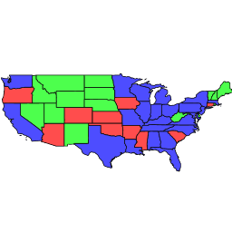
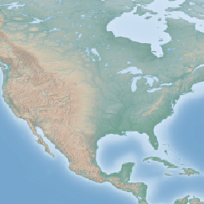
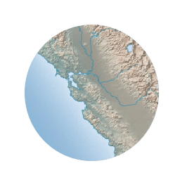
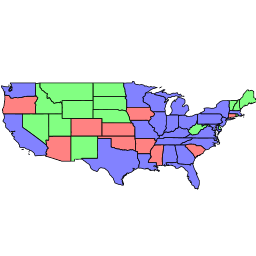
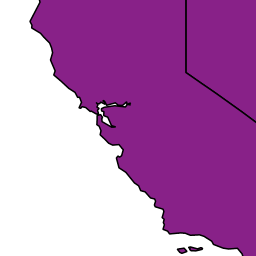

# Composite and blending modes

There are two types of modes: alpha composite and color blending.

Alpha compositing controls how two images are merged together by using the alpha levels of the two. No color mixing is performed, only pure selection of source or destination pixels.

Color blending modes mix the colors of source and destination in various ways. Each pixel in the result is a combination of the source and destination pixels.

The examples shown below illustrate how the modes affect source and destination imagery.

## Source and destination imagery

| Source 1 | Source 2 |
| --- | --- |
|  |  |

| Destination 1 | Destination 2 |
| --- | --- |
|  |  |

## Alpha compositing modes

### copy

Only the source will be present in the output.

| Example 1 | Example 2 |
| --- | --- |
|  |  |

### destination

Only the destination will be present in the output.

*Note:* this page is a reference for the available composite and blending modes in GeoServer. For syntax details, see [Composite blend syntax](../syntax.md).
